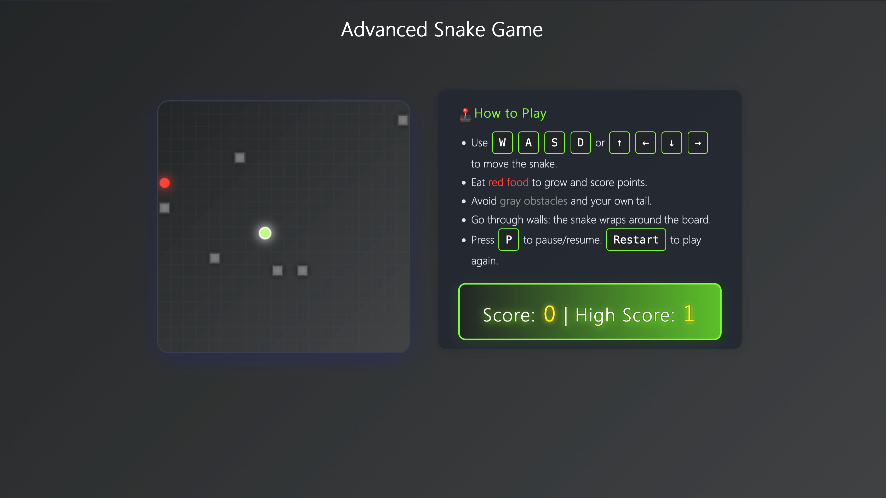

# Snake Game

A modern, visually appealing Snake game built with HTML5, CSS3, and JavaScript.

## Screenshot



## How to Play

- Use <kbd>W</kbd> <kbd>A</kbd> <kbd>S</kbd> <kbd>D</kbd> or <kbd>↑</kbd> <kbd>←</kbd> <kbd>↓</kbd> <kbd>→</kbd> to move the snake.
- Eat <span style="color:#ff4136; font-weight:bold;">red food</span> to grow and score points.
- Avoid <span style="color:#888; font-weight:bold;">gray obstacles</span> and your own tail.
- Go through walls: the snake wraps around the board.
- Press <kbd>P</kbd> to pause/resume. Click <b>Restart</b> to play again.

## Features

- Responsive design
- Obstacles, score, and high score
- Keyboard controls (WASD and arrow keys)
- Pause and restart functionality
- Modern UI/UX

## Project Structure

```
snake-game/
├── assets/              # Images, icons, sounds (if any)
│   └── screenshot.png   # Game screenshot (add your image here)
├── css/
│   └── style.css        # All CSS files
├── js/
│   └── snake.js         # All JavaScript files
├── index.html           # Main HTML file
├── README.md            # Project overview, setup, and instructions
└── ...
```

## Getting Started

1. Open `index.html` in your browser.
2. Play the game!

## Customization
- Add images or sounds to the `assets/` folder.
- Split JS into modules in the `js/` folder as the project grows.
- Update styles in `css/style.css`.

---
Enjoy coding and playing!
